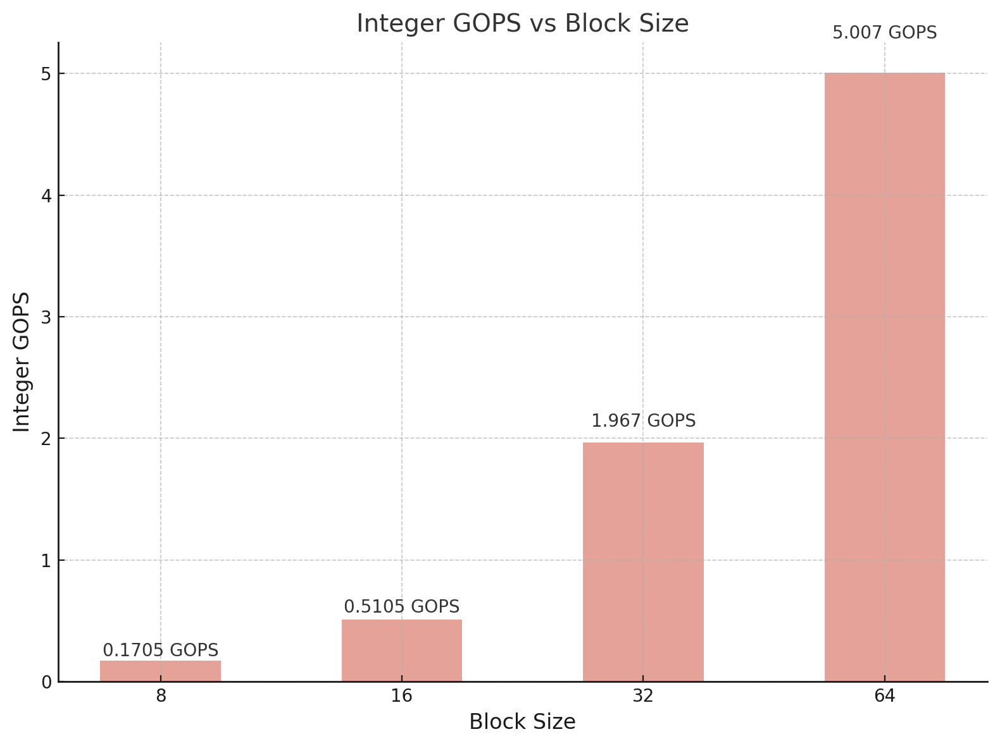
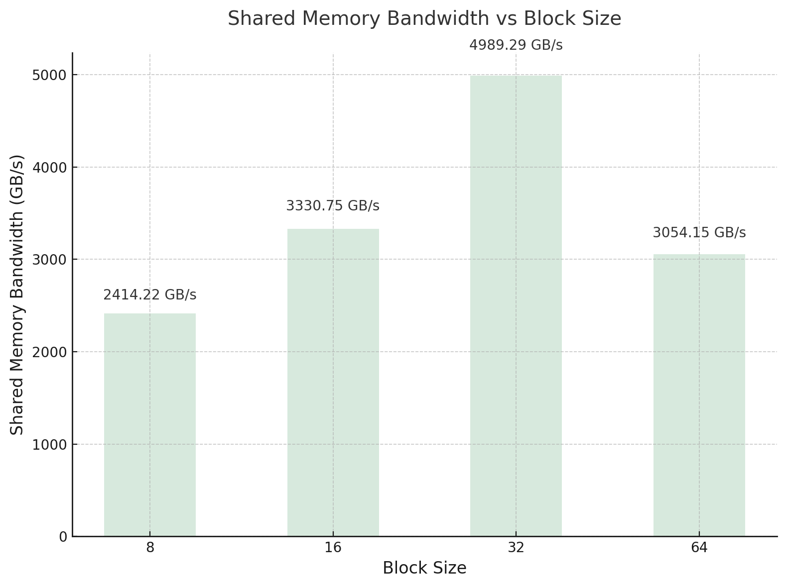
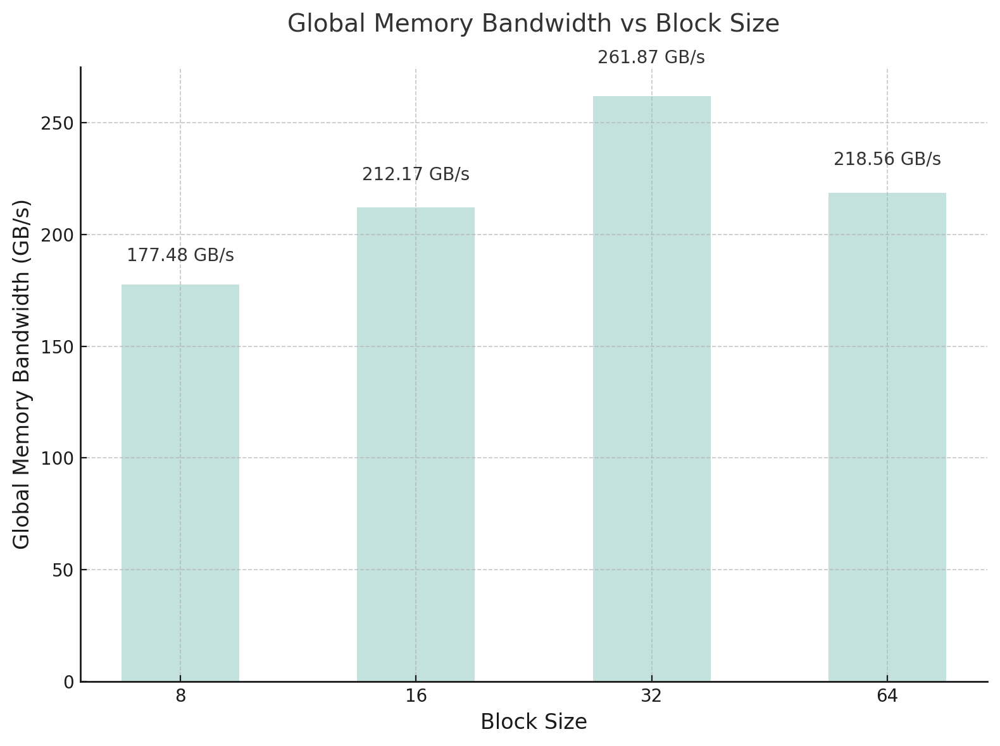
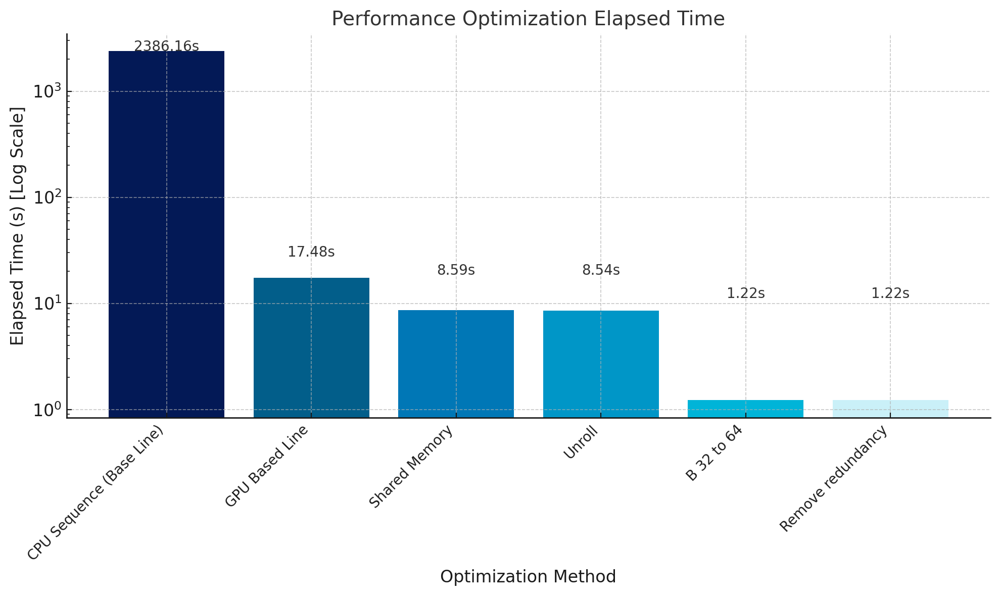
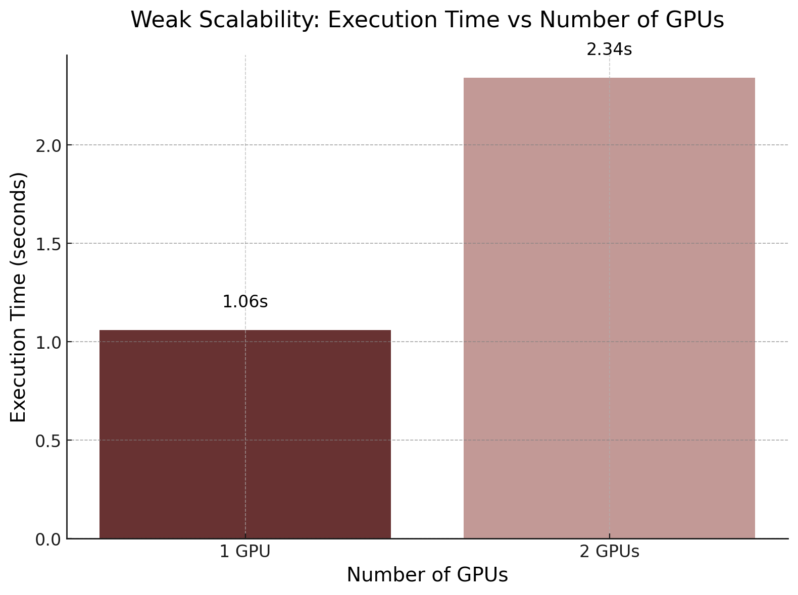
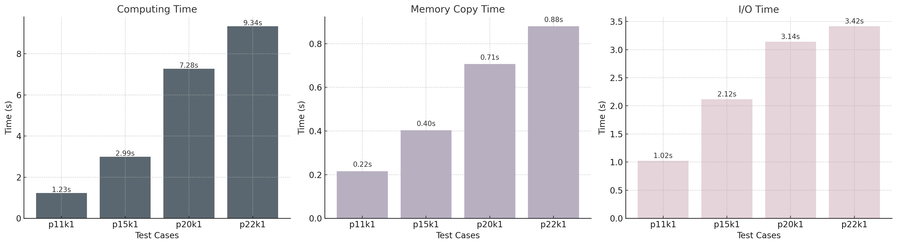
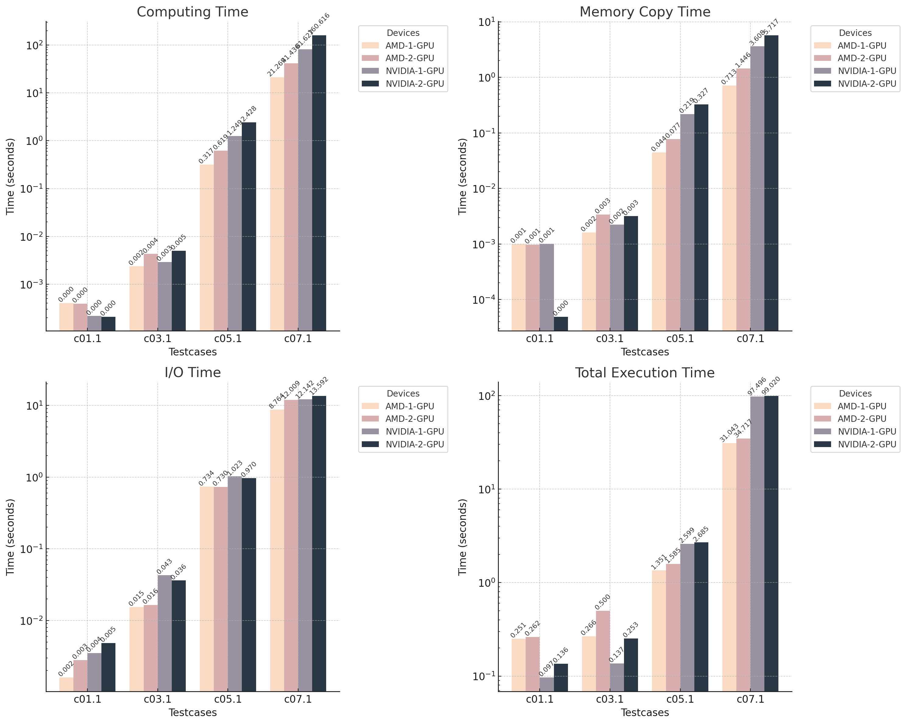

# HW3 Report

## 1. Implementation
### 1.1 Algorithm in hw3-1
我使用以下方法來平行化 Blocked Floyd-Warshall Algorithm:
- **OpenMP**：
    - 使用 OpenMP 將第二階段的 rows 與 columns 區塊的計算分成多個 threads 進行平行處理。
    - 第三階段的計算則使用了雙層平行迴圈進行進一步加速。
    ```C
        /* Phase 2 */
        #pragma omp parallel sections
        {
            #pragma omp section
            cal(B, r, r, 0, r, 1);  // Left
            #pragma omp section
            cal(B, r, r, r + 1, round - r - 1, 1);  // Right
            #pragma omp section
            cal(B, r, 0, r, 1, r);  // Top
            #pragma omp section
            cal(B, r, r + 1, r, 1, round - r - 1);  // Bottom
        }

        /* Phase 3 */
        #pragma omp parallel for collapse(2) schedule(dynamic)
        for (int i = 0; i < round; ++i) {
            for (int j = 0; j < round; ++j) {
                if (i != r && j != r) {
                    cal(B, r, i, j, 1, 1);
                }
            }
        }
    ```
- **SIMD（SSE2）**：
    - 在單一區塊內的計算中，使用 SSE2 指令進行向量化操作，利用 `_mm_loadu_si128` 和 `_mm_min_epi32` 等指令來加速距離矩陣的最小值計算。
    ```C
        for (int i = block_internal_start_x; i < block_internal_end_x; ++i) {
            for (int j = block_internal_start_y; j < block_internal_end_y; j += 4) {
                // Load Dist[i][j] and Dist[k][j] values into SSE2 registers
                __m128i dist_ij = _mm_loadu_si128((__m128i*)&Dist[i][j]);
                __m128i dist_ik = _mm_set1_epi32(Dist[i][k]);
                __m128i dist_kj = _mm_loadu_si128((__m128i*)&Dist[k][j]);

                // Compute dist_ik + dist_kj
                __m128i sum_dist = _mm_add_epi32(dist_ik, dist_kj);

                // Get the minimum of Dist[i][j] and sum_dist using the custom min function
                __m128i new_dist = _mm_min_epi32_sse2(dist_ij, sum_dist);

                // Store the result back to Dist[i][j]
                _mm_storeu_si128((__m128i*)&Dist[i][j], new_dist);
            }
        }
    ```

---

### 1.2 Data Division
#### 1.2.1 HW3-2
1. **Block Division**：
   - 將整個距離矩陣劃分為大小為 `B x B` 的區塊，每個區塊是運算的基本單位。
   - Floyd-Warshall 演算法分為三個階段：
     - **Phase 1**：計算主對角區塊。
     - **Phase 2**：計算 pivot column 和 pivot row 的區塊。
     - **Phase 3**：計算其餘非對角區塊。

2. **單 GPU 處理分割後的資料**：
   - 以 **CUDA Grid and Block** 的方式分配計算任務：
     - 每個 GPU 的 kernel thread 負責處理一個 2x2 的小區塊，並在共享記憶體中載入相關資料以加速計算。
   - 不同階段的資料分割：
     - **Phase 1**：只處理主對角區塊（大小為 `B x B`）。
     - **Phase 2 和 Phase 3**：處理與當前 pivot block 相關的column區塊或row區塊中的資料。。

---
#### 1.2.2 HW3-3
1. **多 GPU 分割資料**：
   - 使用多個 GPU，每張 GPU 都擁有完整的距離矩陣（複製到各自的 device memory）。
   - Floyd-Warshall 的三個階段仍基於區塊進行，但分配方式不同：
     - **Phase 1**：僅由 GPU 0 處理主對角區塊，並將結果同步給其他 GPU。
     - **Phase 2 和 Phase 3**：將 pivot column 和 pivot row 的其他區塊分配給不同的 GPU。

2. **OpenMP 分配任務**：
   - 使用 OpenMP 將每個 GPU 作為一個工作單元，分別處理部分區塊。
   - **不同 GPU 的區塊分配**：
     - 根據 pivot block 的column 和 row 的數量，劃分給不同的 GPU，確保每張 GPU 處理互不重疊的資料。

---

### 1.3 Configuration

在程式中，選擇了以下配置：
```cpp
int rounds = n / B;
dim3 threads(B / 2, B / 2);  // Each thread handles a 2x2 block
dim3 grid_phase1(1, 1); // grid.shape(1,1)
dim3 grid_phase2(rounds, 2); // grid.shape(2,rounds), 2*rounds blocks 
dim3 grid_phase3(rounds, rounds); // grid.shape(rounds,rounds), rounds*rounds blocks 
```

1. **Blocking Factor (B)**
    我使用 `B` = 64，理由如下：
    - 利用共享記憶體可以加速區塊內的資料訪問。
    - `B = 64` 時，每個區塊需使用的共享記憶體大小為 $B \times B \times 4$ bytes，即 16 KB，通常適合大部分 CUDA 設備，不會超過資硬體限制。

2. **Blocks**
    - **Phase 1**：只有一個 Block，因為只需要處理主對角區塊。
    - **Phase 2**：包含兩種類型的 Block：
        - Row-wise：共 $rounds \times 1$ 個 Block。
        - Column-wise：共 $rounds \times 1$ 個 Block。
        - 因為每個 row 跟 column 都各有 rounds 個區塊要處理。
    - **Phase 3**：
        - 網格為 $rounds \times rounds$，總共有 $rounds^2$ 個 Block。
        - 因為撇除前兩個 phase，剩下的區塊需要這麼多的 blocks 來處理。


3. **Threads**
    - 每個 Block 中配置的 Threads 為 $32 \times 32$，這樣每個 Thread 負責計算共享記憶體中 $2 \times 2$ 的資料，透過減少初始化threads 的數量，達到更高效的平行計算。

---

### 1.4 Communication in hw3-3?
- **Phase 1 (中心區塊的處理)：**
    -  由主 GPU (thread ID 0) 負責計算 Phase 1 的中心區塊，該區塊的結果需要與所有其他 GPU 同步。
    -  使用 OpenMP 的 `#pragma omp barrier` 確保所有 GPU 等待 Phase 1 完成，主 GPU 計算完成後，Phase 1 的結果會自動存在該 GPU 的全域記憶體中。
- **Phase 2 (同列與同行的處理)：**
    - 每個 GPU 獨立處理與中心區塊（pivot row/column）相關的計算。
    - 此階段中，各 GPU 無需直接訊，因為所需的中心區塊的資料已經在所有 GPU 上同步，這是通過在初始階段將整個 Dist 矩陣複製到每個 GPU 的全域記憶體來實現的。
- **Phase 3 (非中心區域的處理)：**
    - 各 GPU 負責獨立處理不同的非中心區域，無需進一步的資料通訊，因為所需的資料已經在各自的 GPU 上。
- **結果的整合與主機傳回：**
    - 計算完成後，主 GPU 負責使用 `cudaMemcpyHostToDevice` 將結果從 GPU 的全域記憶體複製回主機記憶體 。
- **主要優化**
    - 避免頻繁的 GPU 間的資料同步：透過在計算初始階段將完整的 Dist 矩陣分配至所有 GPU，避免了每個 Phase 的跨 GPU 資料同步。
    - 同步處理的屏障設置：使用 `#pragma omp barrier` 確保各個 GPU 階段的執行順序，確保 Phase 1 結果算完後才開始後續階段。

---

### 1.5 Implementation Description
Floyd-Warshall 演算法透過動態規劃進行最短路徑更新，結合 CUDA 程式設計進行平行化處理，實現分為以下三個階段：

#### Phase 1: 主對角區塊更新
- 公式：
```math
 D[i][j] = \min(D[i][j], D[i][k] + D[k][j])
 - i,j,k ∈ Diagonal Block
```
- **計算方式：**
  - 使用共享記憶體 (\(\text{Shared Memory}\)) 加速該區塊內部的資料訪問與更新。
  - 每個 Thread 負責計算主對角區塊的一部分。

#### Phase 2: 行列區塊更新
- 公式：
```math
 D[i][j] = \min(D[i][j], D[i][k] + D[k][j])
 Row Update: i ∈ Row Block
 Column Update: j ∈ Column Block
```
- **計算方式：**
  - 共享記憶體讀取主對角區塊，然後透過公式更新 row 與 column 的資料。
  - 每次處理與主對角區塊相鄰的兩種類型區塊（row 與 column）。


#### Phase 3: 非對角區塊更新
```math
 D[i][j] = \min(D[i][j], D[i][k] + D[k][j])
 i,j ∉ Diagonal Block
```
- **計算方式：**
  - 使用 Phase 2 中已更新的 rows 與 columns 的共享資料，處理其他非對角區塊。

---

## 2. Profiling Results

這邊選擇計算量是最大的 `phase3_optimized` 這個 kernel，搭配最大的測資 `p30k1` 來做 profiling，測量 `occupancy`、`sm efficiency`、`shared memory load/store throughput` 和 `global load/store throughput`。

摘要結果如下：
- **Occupancy**: `0.908616`
- **SM Efficiency**: `99.96%`
- **Shared Memory Throughput**:
  - Load: `3199.0 GB/s`
  - Store: `264.94 GB/s`
- **Global Memory Throughput**:
  - Load: `34.764 GB/s`
  - Store: `133.33 GB/s`

詳細輸出如下：
```C++
Profiling results for kernel: phase3_optimized
Profiling metric: achieved_occupancy
==2694961== NVPROF is profiling process 2694961, command: ./hw3-2 testcases/p30k1 p30k1.out
==2694961== Profiling application: ./hw3-2 testcases/p30k1 p30k1.out
==2694961== Profiling result:
==2694961== Metric result:
Invocations                               Metric Name                        Metric Description         Min         Max         Avg
Device "NVIDIA GeForce GTX 1080 (0)"
    Kernel: phase3_optimized(int*, int, int)
        469                        achieved_occupancy                        Achieved Occupancy    0.908192    0.909158    0.908616
-------------------------------
Profiling metric: sm_efficiency
==956353== NVPROF is profiling process 956353, command: ./hw3-2 testcases/p30k1 p30k1.out
==956353== Profiling application: ./hw3-2 testcases/p30k1 p30k1.out
==956353== Profiling result:
==956353== Metric result:
Invocations                               Metric Name                        Metric Description         Min         Max         Avg
Device "NVIDIA GeForce GTX 1080 (0)"
    Kernel: phase3_optimized(int*, int, int)
        469                             sm_efficiency                   Multiprocessor Activity      99.95%      99.96%      99.96%
-------------------------------
Profiling metric: shared_load_throughput
==2695006== NVPROF is profiling process 2695006, command: ./hw3-2 testcases/p30k1 p30k1.out
==2695006== Profiling application: ./hw3-2 testcases/p30k1 p30k1.out
==2695006== Profiling result:
==2695006== Metric result:
Invocations                               Metric Name                        Metric Description         Min         Max         Avg
Device "NVIDIA GeForce GTX 1080 (0)"
    Kernel: phase3_optimized(int*, int, int)
        469                    shared_load_throughput             Shared Memory Load Throughput  3066.5GB/s  3321.6GB/s  3199.0GB/s
-------------------------------
Profiling metric: shared_store_throughput
==956451== NVPROF is profiling process 956451, command: ./hw3-2 testcases/p30k1 p30k1.out
==956451== Profiling application: ./hw3-2 testcases/p30k1 p30k1.out
==956451== Profiling result:
==956451== Metric result:
Invocations                               Metric Name                        Metric Description         Min         Max         Avg
Device "NVIDIA GeForce GTX 1080 (0)"
    Kernel: phase3_optimized(int*, int, int)
        469                   shared_store_throughput            Shared Memory Store Throughput  256.69GB/s  272.34GB/s  264.94GB/s
-------------------------------
Profiling metric: gld_throughput
==2695051== NVPROF is profiling process 2695051, command: ./hw3-2 testcases/p30k1 p30k1.out
==2695051== Profiling application: ./hw3-2 testcases/p30k1 p30k1.out
==2695051== Profiling result:
==2695051== Metric result:
Invocations                               Metric Name                        Metric Description         Min         Max         Avg
Device "NVIDIA GeForce GTX 1080 (0)"
    Kernel: phase3_optimized(int*, int, int)
        469                            gld_throughput                    Global Load Throughput  33.346GB/s  38.086GB/s  34.764GB/s
-------------------------------
Profiling metric: gst_throughput
==956505== NVPROF is profiling process 956505, command: ./hw3-2 testcases/p30k1 p30k1.out
==956505== Profiling application: ./hw3-2 testcases/p30k1 p30k1.out
==956505== Profiling result:
==956505== Metric result:
Invocations                               Metric Name                        Metric Description         Min         Max         Avg
Device "NVIDIA GeForce GTX 1080 (0)"
    Kernel: phase3_optimized(int*, int, int)
        469                            gst_throughput                   Global Store Throughput  130.04GB/s  136.99GB/s  133.33GB/s
-------------------------------
```

---

## 3. Experiment & Analysis

### 3.1 System Specification

使用 Apollo server

---

### 3.2 Blocking Factor
我使用測資 `p11k1` 來做實驗，因為再更大就會 time out。

#### 3.2.1 Integer GOPS
<!--  -->


| Block Size | Integer GOPS | Inst Integer 總和 | 執行時間 (s) |
|------------|--------------|--------------------|----------|
| 8          | 0.1705GOPS   | 2,725,380,416      | 15.981  |
| 16         | 0.5105GOPS   | 4,191,614,272      | 8.208   |
| 32         | 1.967GOPS    | 7,372,862,296      | 3.745   |
| 64         | 5.007GOPS    | 1.3556×10^10       | 2.707   |

- 使用所有 kernel 的整數指令數 (`inst_integer`) 總和，除以總執行時間來計算整體的整數運算性能，並將其轉換為每秒執行的十億次整數操作（GOPS）。
- 從圖中可以發現，隨著 block size 增大，整數運算的效能 (Integer GOPS Integer GOPS) 呈現指數增長。這是因為更大的 block size 可以允許更多的 threads 同時處理資料，提升了平行度與硬體資源利用率。
- 當 B 增加時，更多資料可以被載入到共享記憶體中，減少了對 global memory 的頻繁訪問，從而加速了計算。

#### 3.2.2 Shared Memory Bandwidth
<!--  -->


    
| Block size | Shared Memory Bandwidth | Shared Load Bandwidth | Shared Store Bandwidth  |
| ---------- | ----------------------- | --------------------- | ----------------------- |
| 8          | 2414.22GB/s             | 1847.08GB/s           | 567.14GB/s              |
| 16         | 3330.75GB/s             | 2862.85GB/            | 467.90GB/s              |
| 32         | 4989.29GB/s             | 4575.84GB/s           | 413.45GB/s              |
| 64         | 3054.15GB/s             | 2718.34GB/s           | 335.81GB/s              |

- 共享記憶體的 bandwidth 分為讀取和寫入。我將三個 kernel 的共享記憶體吞吐量根據各自執行時間加權平均，並將 Load 和 Store 的結果相加來得到 shared memory bandwidth。
- 整體共享記憶體吞吐量在 B=32 時達到最高值 4989.29GB/s，這表示此時的記憶體的讀取與寫入利用率最高。 B=8 和  B=64 的吞吐量明顯較低： B=8：吞吐量較低 2414.22GB/s，可能是因為小的 block size 導致更多的 global memory 存取，降低了共享記憶體的效率。B=64：雖然 block size 增大，計算密集度提高，但因記憶體壓力增加，可能導致共享記憶體資源競爭，降低了效率。

#### 3.2.3 Global Memory Bandwidth
<!--  -->


| Block size | Global Memory Bandwidth | Global Load Bandwidth | Global Store Bandwidth |
| ---------- | ----------------------- | --------------------- | ---------------------- |
| 8          | 177.48GB/s              | 35.61GB/s             | 141.87GB/s             |
| 16         | 212.17GB/s              | 69.27GB/s             | 142.90GB/s             |
| 32         | 261.87GB/s              | 69.10GB/s             | 192.77GB/s             |
| 64         | 218.56GB/s              | 60.83GB/s             | 157.73GB/s             |

- 全局記憶體的 bandwidth 同樣分為讀取和寫入。這邊也使用類似的方法，將三個 kernel 的 bandwidth 根據執行時間加權平均後計算 Global Memory Bandwidth 。
- 全局記憶體 bandwidth 在 B=32 時達到最大值 261.87GB/s，這表示 block size 的配置可以最有效地利用記memory bandwidth 。B=8 時 bandwidth 最低，這可能是因為 block size 太小，導致多次訪問增加了記憶體成本。 B=64 時 bandwidth 比 B=32 略低，可能是由於過多 threads 競爭導致效率下降。

- **結論**：
    - Block Size 的設定對整體效能至關重要(可以參考Optimization 的表格)。Block Size 32 是整數運算效能與記憶體頻寬的良好平衡點。然而，Block Size 64 雖然記憶體頻寬有所下降，但整數運算效能的提升更顯著，使其在總體運算時間上優於 Block Size 32。在計算比較密集的任務中，Block Size 64 是更合適的選擇，因為計算性能的提升能彌補記憶體頻寬下降帶來的影響。
---

### 3.3 Optimization (hw3-2)
<!--  -->


| 方法                     | 是否使用 |
|-------------------------|---------|
| Coalesced memory access | ✔️       |
| Shared memory           | ✔️       |
| Handle bank conflict    | ✔️       |
| CUDA 2D alignment       | ✔️       |
| Occupancy optimization  | ✔️       |
| Large blocking factor   | ✔️       |
| Loop Unrolling          | ✔️       |

- 我使用的優化技巧包括 `Coalesced Memory Access`、`Shared Memory`、`Handle Bank Conflict`、`CUDA 2D Alignment`、`Occupancy Optimization`、`Large Blocking Factor(B = 64)` 以及 `Loop Unrolling`。我有試過 `Streaming` ，但還是沒有比較快，所以就拿掉了。其中，我選擇了圖中幾個代表性的方法進行比較：`CPU Baseline`、`GPU Baseline`、使用 `Shared Memory`、使用 `Loop Unrolling`，以及進一步調整 `Blocking Factor` 和 `Remove Redundancy` 。
- 結果顯示，相較於 CPU Baseline 的 2386.16 秒，初版 GPU 將執行時間大幅縮短至 17.48 秒，而引入 Shared Memory 和實現 Loop Unrolling 後進一步降低至 8.54 秒，最終通過調整 Large Blocking Factor 和移除不必要的計算達到了 1.22 秒，表示這個題目很適合使用 GPU 來加速，而每一項加速技巧也確實可以提高效能。

---

### 3.4 Weak Scalability (hw3-3)
<!--  -->


我使用了兩組測資，分別為單 GPU 下矩陣大小 `n = 5000` 的測資 `c04.1` 和雙 GPU 下矩陣大小 `n=11000` 的測資`c05.1`，來測試 weak scalability。 測試結果顯示，單 GPU 的執行時間為 1.06 秒，雙 GPU 的執行時間為 2.34 秒，雙 GPU 時執行時間有所增加，可能是由於其他的通訊成本所造成的。未來或許可以透過優化通訊的部分或是使用更大的測資，進一步提升程式 weak scalability 的表現。

---

### 3.5 Time Distribution
<!--  -->

- **計算時間（Computing Time）**
隨著資料量增加，計算時間呈線性增長。從最小的 `p11k1`（1.23 秒）到最大的 `p22k1`（9.34 秒），顯示計算效率主要受資料量的影響，這也表示程式的可擴展性還不錯。
- **記憶體複製時間（Memory Copy Time）**
GPU 與主機間的資料傳輸時間（H2D 和 D2H）相較於計算時間影響較小，從 `p11k1` 的 0.22 秒增至 `p22k1` 的 0.88 秒，這也表示或許可以優化記憶體的複製來處理大量資料傳輸的情況。針對這個部分我有試過 streaming ，但還是沒有比較快，所以就拿掉了，或許可以試試快別的方法。
- **I/O 時間（I/O Time）**
I/O 的耗時相對較多，從 `p11k1` 的 1.02 秒到 `p22k1` 的 3.42 秒，且隨著資料量的增加有顯著的成長。這表示 I/O 優化是提升整體效能的一個潛在方向，例如採用更高效率的文件格式或平行 I/O。
- 總體來看，計算時間主導了整體效能，而記憶體複製和 I/O 的時間消耗在大資料的情境下不容忽視，或許可以透過進一步優化這些環節以減少瓶頸。


---

## 4. Experiment on AMD GPU
<!--  -->


- **計算時間（Computing Time）**
從圖表中可以看出，對於小型測資 `c01.1`，NVIDIA GPU 在單 GPU 和多 GPU 模式下均顯示出極低的計算時間，這表現了其硬體在處理小資料量時的優勢。然而，隨著測資增大（例如 `c05.1` 和 `c07.1`），NVIDIA 的計算時間增長幅度顯著高於 AMD GPU。相較之下，AMD GPU 的計算時間雖然也隨資料量增加而增長，但其成長幅度較為平穩，顯示其在大規模資料處理上的潛力。 此外，多 GPU 模式在 NVIDIA 和 AMD 平台上均顯示出略高於單 GPU 的計算時間，這可能與多 GPU 間的同步成本有關，表示多 GPU 模式沒有在所有情況下帶來明顯效能提升，尤其是在需要頻繁同步的情境下。因此，針對大型資料量的計算，如果以穩定性為優先，AMD 單 GPU 可能是更好的選擇，而在小型資料集的情況下，NVIDIA GPU 具備更高效能。

- **記憶體複製時間（Memory Copy Time）**
從圖表中可以看出，AMD GPU 和 NVIDIA GPU 的 Memory Copy Time 均隨著資料量的增加呈線性增長。在小型測資 `c01.1` 中，AMD GPU 的 Memory Copy Time 相較 NVIDIA 更顯著，但隨著資料量的增加（如 `c07.1`），兩者的表現趨於接近，且 NVIDIA GPU 的多 GPU 模式下複製時間略高於 AMD GPU。此外，無論是 AMD 還是 NVIDIA，當使用多 GPU 時，Memory Copy Time 都明顯增加，這可能與多 GPU 之間需要額外的資料同步與傳輸有關，導致複製成本增大。總體來說，雖然 AMD GPU 在小型測資下的 Memory Copy Time 表現略顯劣勢，但在處理較大資料量時，其單 GPU 模式的表現更加穩定，而 NVIDIA GPU 在多 GPU 模式下的同步成本則可能成為瓶頸。

- **I/O 時間（I/O Time）**
在 I/O 操作方面，AMD GPU 在所有測資（`c01.1` 至 `c07.1`）中的表現整體優於 NVIDIA GPU，尤其是在小資料量（如 c01.1）的情況下，差距更加明顯。這表示對於 I/O bound 的應用場景，AMD GPU 可能是更為理想的選擇。此外，無論是 AMD 還是 NVIDIA 平台，多 GPU 模式的 I/O 時間普遍高於單 GPU 模式，這可能與多 GPU 同步過程中額外的成本有關。因此，若以減少 I/O 時間為優先目標，選擇 AMD 單 GPU 可能是更為好的方案。

- **總執行時間（Total Execution Time）**
對於資料量較小的測資（如 c01.1 和 c03.1），NVIDIA GPU 在單 GPU 和多 GPU 模式下的執行效率明顯優於 AMD GPU。然而，隨著資料量的增加（如 c05.1 和 c07.1），AMD GPU 的總執行時間表現出更穩定的趨勢，特別是在多 GPU 模式下，時間增長幅度相對較小。總結來說，對於大規模資料的應用場景，AMD 的穩定性和可擴展性更具優勢，而 NVIDIA 在處理小規模資料時仍保持其高速特性。

---

## 5. Experience & Conclusion

### 5.1 Learning Outcomes
- Floyd-Warshall 演算法的平行化：透過 CUDA 和多 GPU 配置，我對 Floyd-Warshall 演算法的內部結構和平行化潛力有了更深入的了解，尤其是分階段的更新方法如何提升計算效率。
- CUDA 優化技巧：學會了多種 CUDA 優化策略，例如共享記憶體的使用、bank conflict 的處理、Memory Coalescing，以及 Loop Unrolling 等技巧，這些技巧能顯著提升 GPU 計算效能。
- GPU 資源配置與分析：學會了如何設置合理的 block size 和 thread 配置。
- 多 GPU 的通訊與同步：了解了多 GPU 間通訊的挑戰，例如跨 GPU 的資料同步和記憶體複製成本。
- AMD 與 NVIDIA 的比較分析： 在進行實驗時，比較了 AMD 和 NVIDIA GPU 的效能，認識到不同 GPU 平台在記憶體複製、I/O 操作以及總執行時間上的特性差異，這讓我對硬體選擇和應用場景的適配有了更深刻的認識。

### 5.2 Feedback (Optional)
- 這次作業是一個非常具有挑戰性但也十分有價值的學習經驗，讓我對 CUDA 和多 GPU 的實際應用有了更深入的理解。謝謝助教！